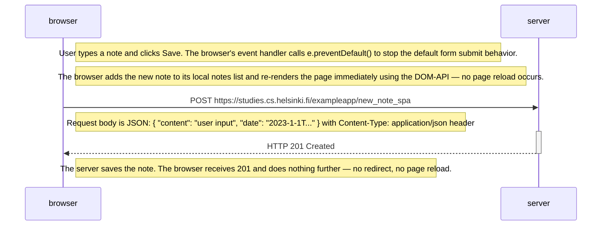

# Exercise 0.6: New note in Single page app diagram

Sequence diagram depicting the situation where a user creates a new note using the SPA version of the notes app.

```mermaid
sequenceDiagram
    participant browser
    participant server

    Note right of browser: User types a note and clicks Save. The browser's event handler calls e.preventDefault() to stop the default form submit behavior.

    Note right of browser: The browser adds the new note to its local notes list and re-renders the page immediately using the DOM-API — no page reload occurs.

    browser->>server: POST https://studies.cs.helsinki.fi/exampleapp/new_note_spa
    Note right of browser: Request body is JSON: { "content": "user input", "date": "2023-1-1T..." } with Content-Type: application/json header
    activate server
    server-->>browser: HTTP 201 Created
    deactivate server

    Note right of browser: The server saves the note. The browser receives 201 and does nothing further — no redirect, no page reload.
```
